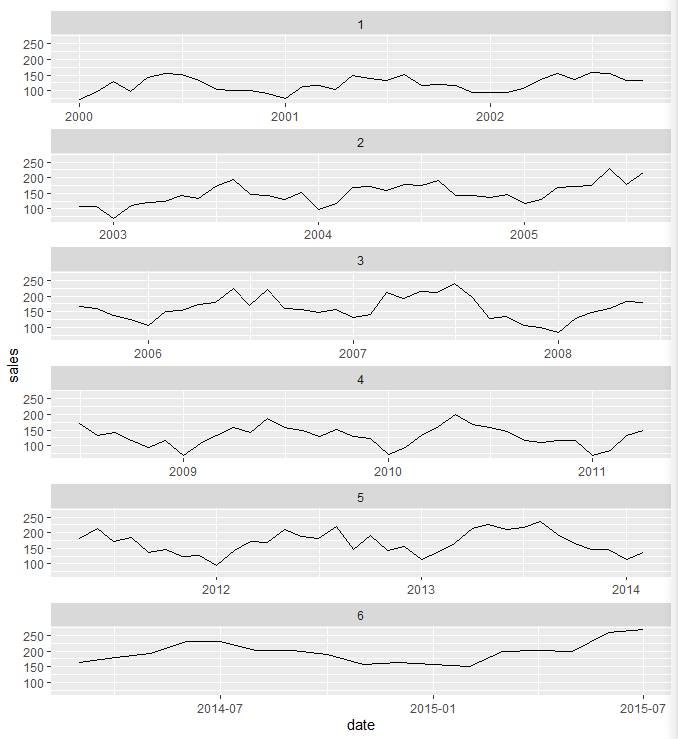
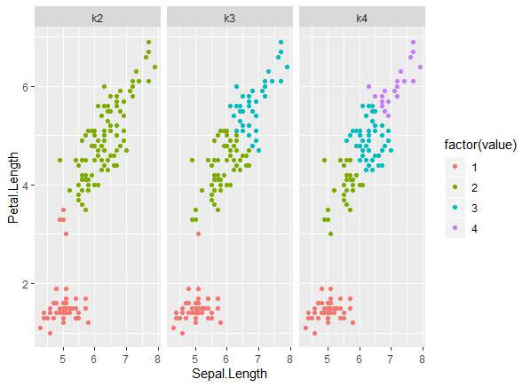

# ggdf

ggplot2 dream functions

## Table of Contents

* [Geoms](#geoms)
  * [geom_sf_krige](#geom_sf_krige)
* [Facets](#facets)
  * [facet_break](#facet_break)
  * [facet_kmeans](#facet_kmeans)

## Intent

Document functions I have no real intention of implementing but would love to see in `ggplot2` or some extension.

## Geoms

### geom_sf_krige

Need to read more into variogram modelling before a current and idealized implementation can be fully realized.

```
library(ggplot2)
library(dplyr)
library(gstat)

# Current implementation ----------------------------------------------
# WIP

# Idealized implementation --------------------------------------------

# WIP
df %>%
  ggplot() +
  geom_sf_krige(aes(formula = x ~ y))
```

## Facets

### facet_break

Breaks a time series chart into multiple facets (one column, many rows).

```r
library(ggplot2)
library(dplyr)

# Current implementation ----------------------------------------------

txhousing %>%
    filter(city == "Abilene") %>%
    mutate(date = paste(year, month, "1", sep = "-"),
           date = as.Date(date),
           rbreak = ceiling(seq(1, 187) / 34)) %>%
    ggplot(aes(date, sales)) +
    geom_line() +
    facet_wrap(vars(rbreak), scales = "free_x", ncol = 1)

    
# Idealized implementation --------------------------------------------

txhousing %>%
    ggplot(aes(date, sales)) +
    geom_line() +
    facet_break(vars(date), breaks = 6)
```



### facet_kmeans

Performs kmeans clustering on two variables; `geom_point()` compliments this facet.

```r
# Current Implementation ----------------------------------------------

# Number of clusters
n <- 2:4 

kdata <- iris[, c("Sepal.Length", "Petal.Length")]

# Run kmeans
klusters <- lapply(n, kmeans, x = kdata)

# Extract clusters
clusters <- Reduce(cbind, lapply(klusters, `[[`, "cluster"))

colnames(clusters) <- paste0("k", n)

kdata_long <- cbind(kdata, clusters) %>%
  tidyr::gather(... = k2:k4)

kdata_long %>%
  ggplot(aes(x = Sepal.Length, 
             y = Petal.Length, 
             color = factor(value))) +
  geom_point() +
  facet_wrap(vars(key))


# Idealized Implementation --------------------------------------------

iris %>%
  ggplot(aes(x = Sepal.Length, y = Petal.Length)) +
  geom_point() +
  facet_kmeans(
    k = 2:4,  # passed on to kmeans()
    aesthetics = c("color") # or "fill" if pch = 21
    )

# Also facet_sf_kmeans()...wip
```


